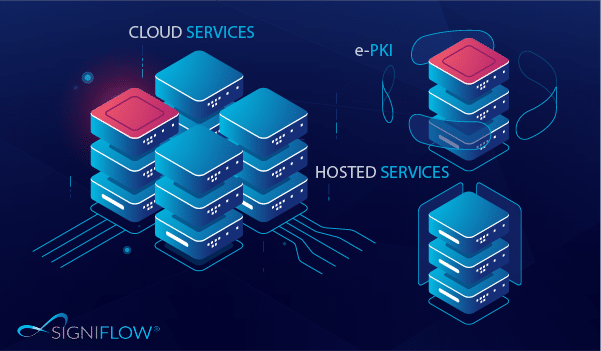

# 🔑 Obtaining Credentials
## 😎Overview

Making API calls to the EasiFlow API, requires a SigniFlow user account, or trial account and an X-API key.

<!-- theme: info -->

> SigniFlow maintains 8 cloud enviroments around the globe, you can sign up for a [30 Day Free Trial Account](https://accountsetup.signiflow.com/trial) on any of the regional data centres.

## 🌎 Data Centre List

* [Pre-Production](https://preprod.signiflow.com)
* [Asia - Singapore (UTC+08:00)](https://flow.signiflow.asia)
* [Australia - Sydney (UTC+10:00)](https://au.signiflow.com)
* [Europe - Netherlands (UTC+01:00)](https://eu.signiflow.com)
* [South Africa - Johannesburg (UTC+02:00)](https://flow.signflow.co.za)
* [South America - Brazil (UTC-03:00) ](https://latam.signiflow.com)
* [United States - Virginia (UTC-04:00)](https://us.signiflow.com)
* [United Kingdom - London (UTC 00:00)](https://uk.signiflow.com)

## ☁️ Data Centre Overview
* [Data Centre Overview](https://www.signiflow.com/data-centres/)
<!--
focus: false
-->

## 🔒 X-API Key

The EasiFlow API methods require an X-API Key, passed as Header: `X-API-Key` Value: `xxxx-xxxx-xxxx-xxxxxxxx`
To obtain your X-API Key, please email : [support@signiflow.com](mailto:support@signiflow.com?subject=API%20Key%20Assistance) with details of the email address used to create your SigniFlow account. 

<!-- theme: warning -->
>The X-API Key must be associated to the same email address of the SigniFlow user-account.  

## 🙋 Support Contact

Alternatively please reach out to our support desk for assistance with an API Account.

* Email : [support@signiflow.com](mailto:support@signiflow.com?subject=API%20Assistance)
* Support Portal : [Helpdesk](https://support.signiflow.com/portal/en/home)
* Academy : [Online Help](https://www.signiflow.com/academy/)
* Videos : [YouTube](https://www.youtube.com/c/SigniFlow)

---
